# Kubernetes Üzerinde High Availability (HA) Citus Kurulumu: Patroni ve Kind ile Uygulamalı Rehber

Veritabanı dünyasında ölçeklenebilirlik (scalability) ve yüksek erişilebilirlik (high availability - HA) genellikle en kritik gereksinimlerdir. PostgreSQL'i yatayda ölçeklemek için **Citus**, HA yapısını yönetmek için ise **Patroni** lider çözümler arasında yer almaktadır.

Bu yazıda, teorik karmaşadan uzaklaşarak, kendi bilgisayarımızda **Kind (Kubernetes in Docker)** kullanarak production ortamına benzer bir **Citus + Patroni** kümesini nasıl ayağa kaldıracağımızı adım adım inceleyeceğiz. Hedef mimarimiz: **1 Coordinator (Master) + 2 Worker grubu** (her grupta Patroni ile yönetilen replikalar).

> **Not:** Bu rehberde kullanılan tüm kurulum dosyalarına (`citus_k8s.yaml`, `Dockerfile.citus`, `entrypoint.sh`, `kind-cluster.yaml`) aşağıdaki GitHub reposundan erişebilirsiniz:
>
> [GitHub Repo](https://github.com/baristan74/citus-patroni-k8s/tree/main)

---

## Bölüm 1: Teorik Temeller

### Citus Nedir? (Distributed PostgreSQL)
Citus, PostgreSQL'i dağıtık bir veritabanına dönüştüren açık kaynaklı bir eklentidir. Veriyi **shard** (parça) adı verilen dilimlere böler, bu shard'ları worker düğümlerine yerleştirir ve sorguları bu worker düğümlerde paralel çalıştırarak performansı artırır.

**Citus Mimarisi:**
*   **Coordinator Node:** Uygulamanızın bağlandığı ana düğümdür. Sorguları karşılar, planlar ve ilgili worker node'lara dağıtır. Metadata'yı (hangi verinin nerede olduğu bilgisi) tutar.
*   **Worker Nodes:** Asıl veriyi tutan ve işleyen düğümlerdir. Her worker düğüm kendisine atanan veri parçaları üzerinde bağımsız çalışır.
*   **Shard:** Bir tabloda tanımlanan dağıtım anahtarına göre bölünmüş veri parçasıdır. Her shard belirli bir worker düğümüne atanır ve iş yükü dağıtılarak ölçeklenebilirlik sağlanır.
*   **Distribution Key:** Shard'lama için kullanılan sütundur (örn. tenant_id, company_id). Yük dengeleme ve co-location için önemlidir.

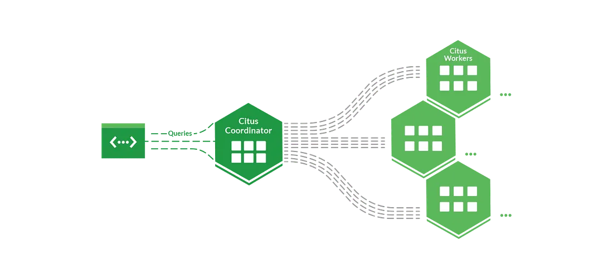

### Tablo Dağıtım Stratejileri (Citus Tablo Tipleri)
Citus'ta, verilerin nasıl dağıtıldığına ve sorgulandığına bağlı olarak farklı tablo tipleri bulunur. Doğru tablo tipini seçmek, performans ve ölçeklenebilirlik açısından kritik öneme sahiptir.

#### 1. Dağıtık Tablolar (Distributed Tables)
Veriler, shard adı verilen parçalara ayrılarak worker düğümlerine dağıtılır (Örn: `table_1001`, `table_1002`). 

*   **Yüksek Ölçeklenebilirlik:** Veri büyüdükçe yeni worker düğümleri eklenerek performans korunur.
*   **Paralel Sorgu İşleme:** Sorgular farklı düğümlerde eş zamanlı çalıştırılarak hızlandırılır.
*   **Bölümlenmiş İş Yükü:** Veritabanının yükü tüm worker düğümlerine bölünerek dengeli bir dağılım sağlanır.

**Veri Dağıtımı Yöntemleri (Sharding Modelleri):**
*   **Satır Bazlı Dağıtma:** Veriyi satır bazında dağıtır. Her satır, belirli bir kritere (örneğin kullanıcı ID'si) göre farklı bir shard'a atanır. Bu yöntem, büyük tabloları yatay olarak bölmek ve sorgu performansını artırmak için en yaygın kullanılan yöntemdir.

    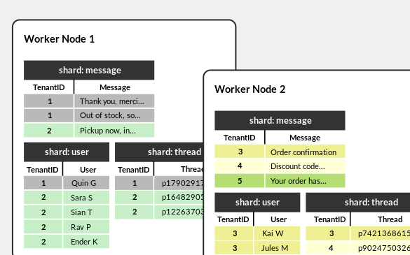

*   **Şema Bazlı Dağıtma:** Veriyi şema bazında dağıtır. Her şema (yani bir veritabanı içindeki tablolar kümesi) farklı bir parçada saklanır. Bu yöntem, çok müşterili (multi-tenant) uygulamalar için uygundur.

    

#### 2. Referans Tablolar (Reference Tables)
Referans tablolar, küçük ve sık erişilen veriler için kullanılır. Her worker düğümünde tam bir kopyası bulunduğundan, sorgular ağ üzerinden başka bir düğüme erişmek zorunda kalmadan yerel olarak çalıştırılabilir.

*   **Hızlı JOIN İşlemleri:** Referans tablolara yapılan JOIN işlemleri çok hızlıdır, çünkü her düğüm kendi kopyasına doğrudan erişebilir.
*   **Veri Tutarlılığı (2PC):** Merkezi bir değişiklik tüm worker düğümlerine otomatik olarak senkronize edilir. Bu senkronizasyon, **İki Aşamalı Commit (2PC)** mekanizması ile gerçekleştirilir.

**Örnek Kullanım Alanları:** Ülkeler, para birimleri, kullanıcı rolleri gibi az değişen veriler.

#### 3. Yerel Tablolar (Local Tables)
Yerel tablolar, yalnızca coordinator düğümünde saklanan ve worker düğümlerine dağıtılmayan standart PostgreSQL tablolarıdır.

*   **Bağımsız Kullanım:** Yalnızca coordinator düğümünde tutulduğu için diğer düğümlerle senkronizasyon gerektirmez.
*   **Kısıtlar:** Büyük veri kümeleri için uygun değildir çünkü ölçeklenemez. JOIN işlemlerinde worker düğümlerine dağıtılmadığı için performans kaybına neden olabilir.

**Örnek Kullanım Alanları:** Uygulama giriş/kimlik doğrulama tabloları ve küçük yönetimsel tablolar.

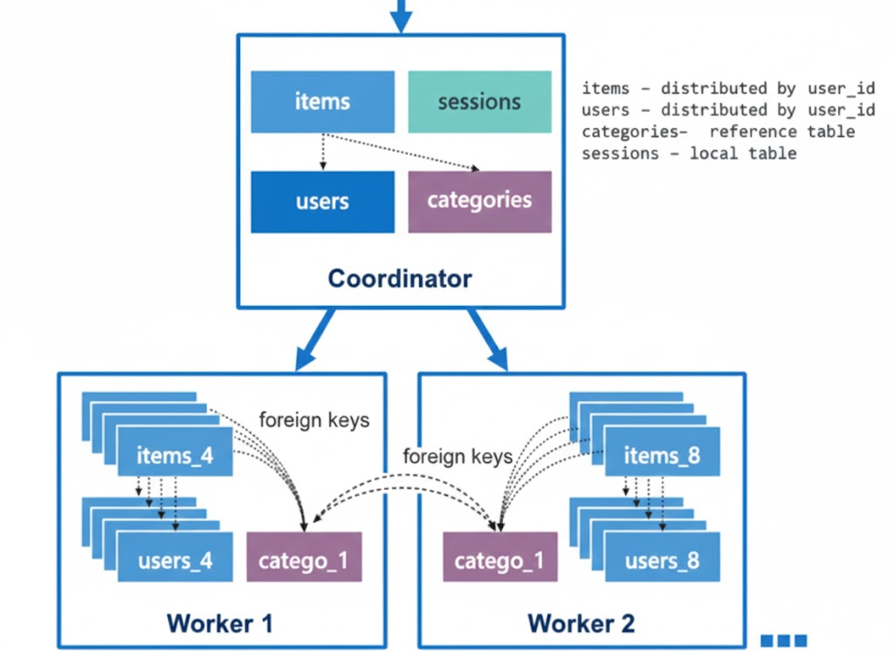

### Citus'ta Sorgu Dağıtımı

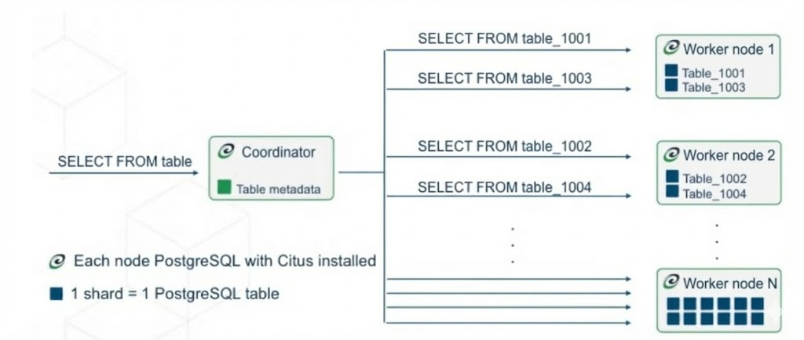

Citus'ta coordinator node, uygulamadan gelen sorguları karşılar ve metadata bilgisini kullanarak bu sorguyu ilgili veri parçacıklarını (shard) barındıran worker node'lara dağıtır. İşlem paralel olarak gerçekleştirilir ve sonuçlar birleştirilerek uygulamaya döndürülür.

### Citus Metadata Tabloları

Citus coordinator düğümünde tutulan metadata tabloları, dağıtık veritabanının yapısını ve işleyişini yönetmek için kullanılır. Bu tablolarda, hangi shard'ların hangi worker düğümlerinde bulunduğundan, verilerin nasıl dağıtıldığına kadar birçok önemli bilgi saklanır.

Temel metadata tabloları:

| Tablo Adı | Açıklama |
| :--- | :--- |
| **pg_dist_partition** | Hangi tabloların dağıtık olduğunu, dağıtım yöntemini (hash, append, referans) ve hangi kolon üzerinden dağıtıldığını saklar. |
| **pg_dist_shard** | Her bir shard'ın (yani dağıtık tablonun bir veri parçasının) detaylarını saklar. |
| **pg_dist_placement** | Her bir shard'ın hangi worker düğümlerinde yer aldığını ve bu yerleşimin durumunu takip eder. |
| **pg_dist_node** | Worker düğümlerin konum ve durum bilgilerini saklar. |

### Patroni Nedir? (HA Orchestration)
PostgreSQL doğası gereği "Single Master" mimarisine sahiptir. Master sunucu erişilemez hale gelirse sistem durur. Patroni, bu riski yönetmek için geliştirilmiş bir HA (High Availability) çözümüdür:
*   **Otomatik Lider Seçimi (Leader Election):** Küme içindeki en sağlıklı düğümü lider olarak seçer.
*   **Otomatik Failover:** Lider çökerse, veri kaybını en aza indirecek şekilde en güncel replikayı yeni lider olarak atar.
*   **DCS (Distributed Configuration Store) Entegrasyonu:** Etcd, Consul veya Kubernetes API gibi dağıtık veri depolarını kullanarak küme durumunu tutarlı bir şekilde yönetir ve servislerin doğru pod'a yönlenmesini sağlar.

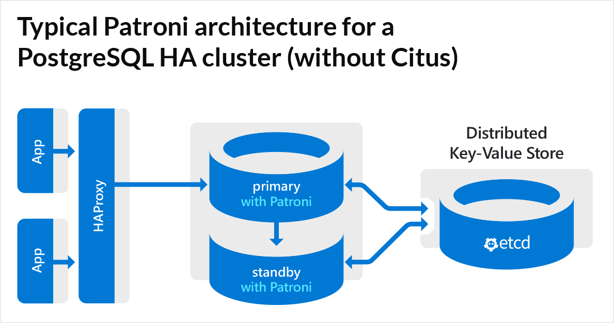

### Patroni 3.0 ile Citus Entegrasyonu
Patroni 3.0 sürümü ile birlikte Citus kümeleri için yerleşik (native) HA desteği sunulmuştur. Önceki sürümlerde Citus ve Patroni entegrasyonu daha manuel yapılandırma gerektirirken, 3.0 ile süreç otomatize edilmiştir:

*   **Citus Farkındalığı:** Patroni artık yönettiği düğümün bir Citus coordinator mı yoksa worker mı olduğunu bilir.
*   **Otomatik Metadata Güncellemesi:** Bir worker düğümünde failover gerçekleştiğinde (örneğin `worker-1-a` yerine `worker-1-b` geçtiğinde), Patroni bu değişikliği coordinator üzerindeki metadata tablolarına (`pg_dist_node`) otomatik olarak yansıtır.
*   **Kesintisiz İşleyiş:** Bu entegrasyon sayesinde, bir düğüm kaybı yaşandığında uygulama katmanı veya veritabanı yöneticisi müdahale etmeden sistem kendini onarır ve sorgular yeni lider düğümlere yönlendirilir.

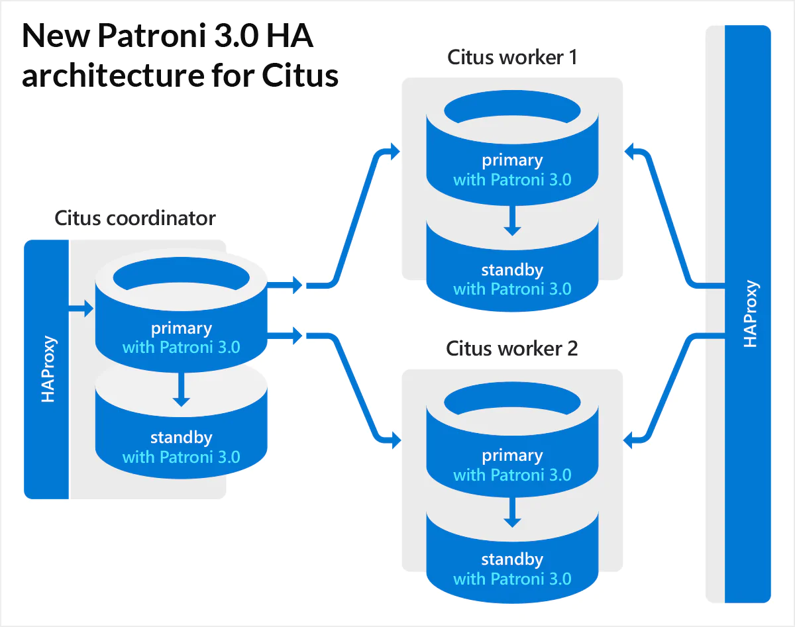

---

## Bölüm 2: Pratik Uygulama (Kind ile Kurulum)

**Gereksinimler:** Docker, Kind

### Adım 1: Kubernetes Cluster'ı Hazırlama

Öncelikle Kind ile local bir Kubernetes cluster'ı oluşturuyoruz. Bu işlem, bilgisayarınızda sanal bir Kubernetes ortamı yaratır.

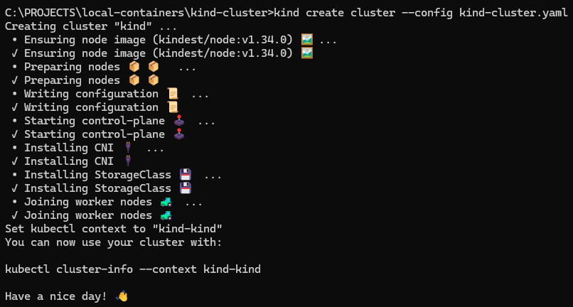

Cluster hazır olduğunda `kubectl get nodes` ile durumu doğrulayabilirsiniz.

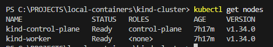

### Adım 2: Docker İmajını Hazırlama
Citus ve Patroni'nin kurulu olduğu bir PostgreSQL imajına ihtiyacımız var. `Dockerfile.citus` dosyasını kullanarak bu imajı oluşturacağız. 

**İmajı build ediyoruz:**

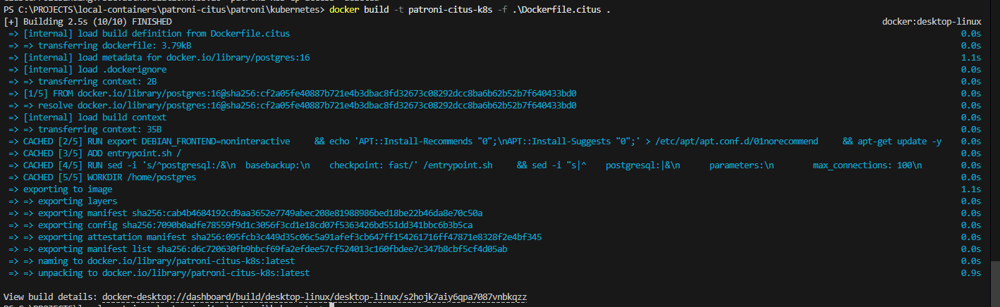

**İmajı Kind cluster'ına yüklüyoruz (Registry kurmakla uğraşmamak için):**

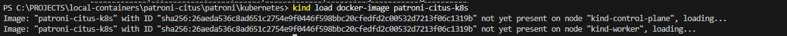

### Adım 3: Citus Kümesini Kurma 
`citus_k8s.yaml` dosyasını kullanarak pod'ları ayağa kaldıracağız. Bu dosya; RBAC (Role Based Access) yetkilerini, StatefulSet'leri (coordinator ve worker grupları için) ve Servisleri içerir.

**Grup Mantığı:**
*   **Grup 0:** Coordinator kümesi (Patroni ile yönetilen)
*   **Grup 1, 2:** Worker kümeleri (Her biri kendi içinde HA yapısına sahip)

<p align="center">
  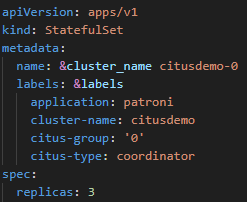
  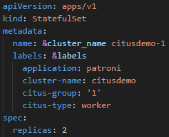 
  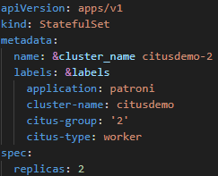
</p>

**Kurulumu başlatalım:**

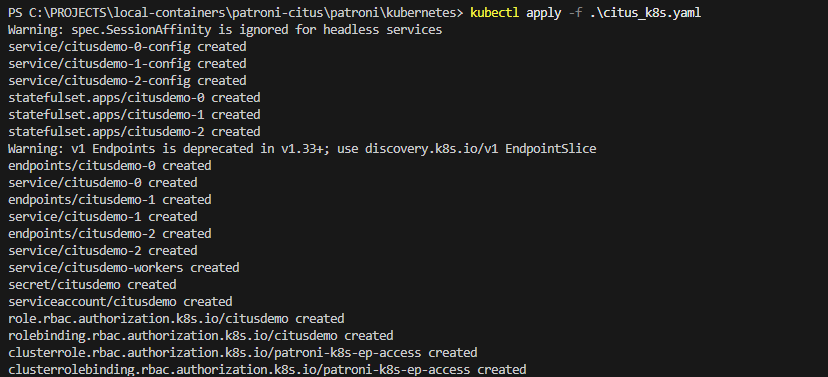

**Podların durumunu izleyelim (Hepsi `Running` olana kadar bekleyin):**

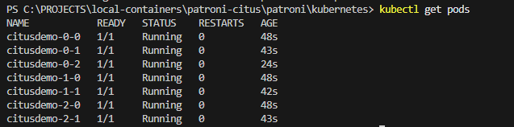

**Podların etiketlerine (labels) bakarak hangi podun hangi rolde (primary/replica) olduğunu görebiliriz:**

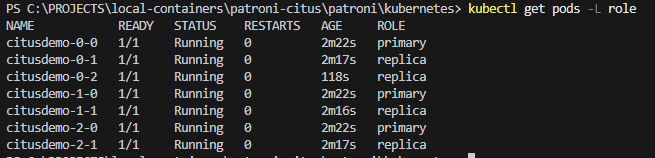

Gözlem sonucunda; 1 adet primary coordinator ve 2 adet replica'sı, ayrıca her worker grubu için de 1 primary ve 1 replica olduğunu doğruluyoruz.

### Adım 4: Küme Sağlığını ve Topolojiyi Doğrulama
Kurulum tamamlandı, şimdi hem Patroni seviyesinde küme sağlığını hem de Citus seviyesinde düğüm topolojisini kontrol edelim.

**Öncelikle `patronictl` aracı ile Patroni küme durumunu sorgulayalım:**

```bash
# Herhangi bir podun içine giriyoruz
kubectl exec -it citusdemo-0-0 -- bash
```

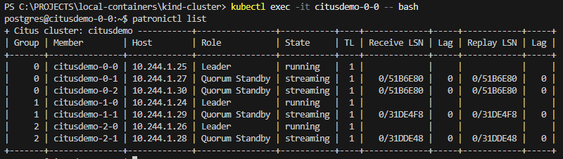

Şimdi PostgreSQL'e bağlanıp Citus'un düğümleri nasıl gördüğüne bakalım. Henüz tablo oluşturmadığımız için shard tablosunun boş ancak node tablosunun dolu olmasını bekliyoruz.

**Pod içerisindeyken psql'e bağlanalım:**

```bash
# Pod içerisindeyken psql'e bağlanalım
psql -U postgres -d citus
```

**Citus metadata tablolarını sorgulayalım:**

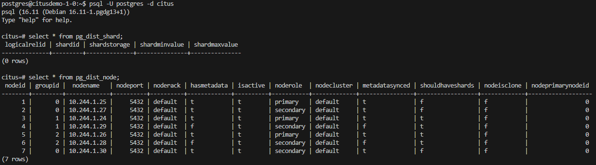

Bu çıktı bize şunları gösteriyor:
*   **groupId 0:** Coordinator grubu, 1 primary, 2 secondary (Replica) var.
*   **groupId 1 ve 2:** Worker grubu, her birinde 1 primary, 1 secondary var.

### Adım 5: Veri Dağıtımı ve Sharding Testi
Sistem sağlıklı görünüyor. Şimdi dağıtık bir tablo oluşturup verinin worker node'lara nasıl dağıldığını gözlemleyelim.

**Örnek bir tablo oluştur:**

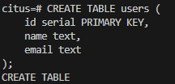

**Tabloyu `id` kolonuna göre dağıt (Shard et):**

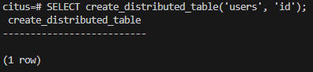

**Rastgele 1000 adet veri üret:**

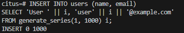

Veriler eklendi. Şimdi bu verilerin hangi node'larda tutulduğunu görelim.

**Shard'ların node'lara dağılımını gör:**

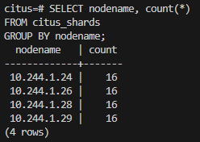

> **Önemli Not:** Yukarıdaki çıktıda görülen sayılar, node'larda bulunan **shard (parça)** sayılarıdır, tablodaki satır sayısı değildir. Citus, veriyi mantıksal parçalara (shard) böler ve bunları fiziksel node'lara dağıtır.

**Tablodaki toplam veri sayısını ve dağılımını doğrulamak için standart `COUNT(*)` sorgusunu çalıştıralım:**

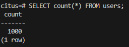

Bu sonuçlar şunları gösteriyor:
1.  Veriler worker node'ları (örneğin `10.244.1.24` ve `10.244.1.26`) arasında dengeli bir şekilde paylaştırılmıştır.
2.  **Coordinator node** üzerinde herhangi bir uygulama verisi tutulmamaktadır.
3.  Veriler shard'lara bölünmüş ve replikasyon stratejisine uygun olarak yedekli (replica) node'lara da kopyalanmıştır.

### Adım 6: Failover Senaryosu ve Dayanıklılık Testi

HA (Yüksek Erişilebilirlik) test edebilmek için, bir şeyler bozulduğunda sistemin ayakta kaldığını görmeliyiz.

**Senaryo:** Coordinator liderini (`citusdemo-0-0`) zorla kapatacağız ve Patroni'nin yeni bir lider seçmesini (Failover) canlı olarak izleyeceğiz.

**1. İzleme Modunu Açın:**

Yeni bir terminal açın ve Patroni durumunu anlık takip etmek için şu komutu çalıştırın. Başlangıçta `citusdemo-0-0` lider durumundadır:

```bash
kubectl exec -it citusdemo-0-1 -- watch -n 1 "patronictl list"
```

*Başlangıç Durumu:*


**2. Lider Pod'u Silin (Simüle Edilmiş Çökme):**

Diğer terminalden mevcut lider podunu silerek bir çökme senaryosu oluşturun:

```bash
kubectl delete pod citusdemo-0-0
```

**3. Yeni Lider Seçimini Gözlemleyin:**

İzleme ekranında `citusdemo-0-0`'ın durumunun değiştiğini ve replikalardan birinin (örneğin `citusdemo-0-2`) otomatik olarak **Leader** rolüne yükseldiğini göreceksiniz.

*Failover Sonrası Durum:*


Bu test sonucunda; Patroni'nin lider kaybını algıladığını, replikalardan birini yeni lider olarak atadığını ve Citus kümesinin (kısa bir kesinti sonrası) yeni lider ile çalışmaya devam ettiğini gözlemlemiş olduk.

---

## Bölüm 3: Operasyonel İpuçları ve Performans

### 3.1 Co-Location ve Join Performansı
İlişkili tabloları aynı distribution key ile dağıtırsanız (Co-location), Citus join işlemlerini ağ trafiği oluşturmadan worker node üzerinde yerel olarak yapar.

```sql
-- Reference Table örneği (Tüm workerlara kopyalanır)
CREATE TABLE tenants (id INT PRIMARY KEY, name TEXT);
SELECT create_reference_table('tenants');

-- Distributed Table
CREATE TABLE tenant_metrics (tenant_id INT, metric_val NUMERIC);
SELECT create_distributed_table('tenant_metrics', 'tenant_id');

-- Bu join işlemi çok hızlıdır çünkü veri yereldir
SELECT tm.metric_val, t.name
FROM tenant_metrics tm
JOIN tenants t ON t.id = tm.tenant_id;
```

### 3.2 Worker Ekleyip Rebalance (Yeniden Dengeleme)
Citus'un en büyük gücü, veri büyüdükçe sisteme yeni donanım ekleyebilmektir. Yeni bir worker grubu (örn: `citusdemo-3`) eklediğinizde, verilerin ve yükün eşit dağılması için shard'ların taşınması gerekir. Citus bunu **Shard Rebalancer** ile yönetir.

```sql
-- Yeni node'u kümeye tanıtma
SELECT citus_add_node('citusdemo-3.default.svc.cluster.local', 5432);

-- Verileri yeniden dengeleme (Online işlem)
SELECT rebalance_table_shards('users');
```

> **İpucu:** Rebalancing işlemi veri taşıma içerdiği için ağ ve disk I/O trafiği yaratır. 

---

## Sonuç

Bu yazı, PostgreSQL'in Citus ile yatay ölçeklenmesini ve Patroni ile yüksek erişilebilirlik sağlanmasını kapsamaktadır.

Citus'un dağıtık mimarisi, tablo tipleri ve sharding stratejileri gibi temel kavramların yanı sıra Patroni'nin lider seçimi ve failover mekanizmaları detaylı olarak ele alınmıştır.

Kind üzerinde simüle edilen Kubernetes ortamında gerçekleştirilen uçtan uca kurulum ile verinin worker node'lara dağılımı ve failover senaryolarında sistemin dayanıklılığı test edilmiştir.

Bu kurulum production ortamı için doğrudan uygun olmasa da sağlam bir temel oluşturur. Gerçek dünyada bu yapı; her bir node'un gerçek bir fiziksel veya sanal makinede konumlandırılması ve ek olarak **Load Balancer (PgBouncer/HAProxy)**, **Kalıcı Depolama (PVC)** yönetimi ve **Gözlemlenebilirlik (Prometheus/Grafana)** katmanlarının dahil edilmesiyle production'a hazır hale getirilebilir.

**Kaynaklar:**

*   [Patroni GitHub](https://github.com/patroni/patroni)
*   [Citus GitHub](https://github.com/citusdata/citus)
*   [Citus Documentation](https://docs.citusdata.com/en/v13.0/)
*   [Patroni 3.0 and Citus Blog](https://www.citusdata.com/blog/2023/03/06/patroni-3-0-and-citus-scalable-ha-postgres/)


